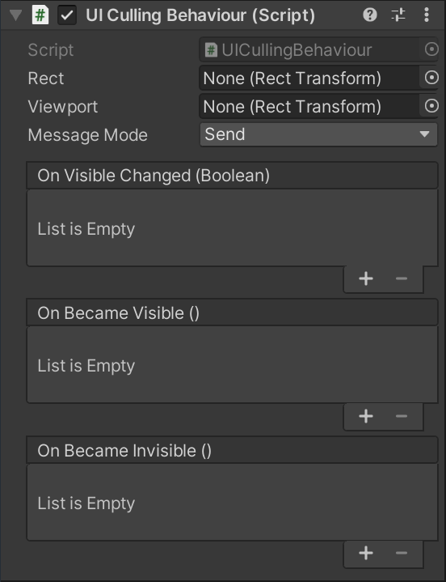

# UI Culling for Unity

This package provides a Component to trigger OnBecameVisible / OnBecameInvisible magic-methods and events, when an uGUI widget enters and exits a specific RectTransform.

These events are often useful to toggle expensive logic. For example to disable a Camera that renders to a RenderTexture to display animated 3D characters in the UI, but was moved outisde the visible area of a ScrollView.

uGUI doesn't trigger the OnBecameVisible and OnBecameInvisible events on widgets. Unity Technologies was asked to implement it, but it seems they didn't entirely implement it yet, see [here](https://forum.unity.com/threads/onbecamevisible-does-not-fire-for-canvasrenderers.290641/).

# Video
Below you can find a YouTube video where I explain what the ```UICullingBehaviour``` can be used for.

[](https://youtu.be/qvcg46J6wA8 "")

# UICullingBehaviour Component

The ```UICullingBehaviour``` Component is used to trigger these OnBecameVisible and OnBecameInvisible events for uGUI widgets.



| Property  | Description|
|----------|---------------|
| ```Rect``` | A reference to a RectTransform whose rectangle is used to test whether it's inside the ```Viewport```, in which case the Rect is considered visible. Only spacial checks are performed, the alpha/transparency isn't considered. |
| ```Viewport``` | A reference to a RectTransform that represents the viewport, for example the visible area of a ScrollView. See above ```Rect``` description. |
| ```Message Mode``` | Unity features the [OnBecameVisible](https://docs.unity3d.com/ScriptReference/MonoBehaviour.OnBecameVisible.html) and [OnBecameInvisible](https://docs.unity3d.com/ScriptReference/MonoBehaviour.OnBecameInvisible.html) magic-methods. This property allows you to call them.<br><br>```Send``` will perform a [GameObject.SendMessage](https://docs.unity3d.com/ScriptReference/GameObject.SendMessage.html) on the gameObject where the UICullingBehaviour is added to.<br>```Broadcast``` will perform a [GameObject.BroadcastMessage](https://docs.unity3d.com/ScriptReference/GameObject.BroadcastMessage.html) on the gameObject where the UICullingBehaviour is added to.<br>```None``` will not Send/Broadcast any message. |
| ```On Visible Changed``` | An Unity Event that can be used to set up method callbacks through the Inspector. It's called when the ```Rect``` becomes visible or invisible in the ```Viewport```.  This event is raised even when ```Message Mode```is set to ```None```. |
| ```On Became Visible``` | An Unity Event that can be used to set up method callbacks through the Inspector. It's called when the ```Rect``` entered the ```Viewport```.  This event is raised even when ```Message Mode```is set to ```None```. |
| ```On Became Invisible``` | An Unity Event that can be used to set up method callbacks through the Inspector. It's called when the ```Rect``` exited ```Viewport```. This event is raised even when ```Message Mode```is set to ```None```. |

# Installation

In Unity's Package Manager, choose "Add package from git URL" and insert one of the Package URL's you can find below.


## Package URL's

Please see the ```CHANGELOG.md``` file to see what's changed in each version.

| Version  |     Link      |
|----------|---------------|
| 1.0.0-pre.1 | https://github.com/pschraut/UnityUICulling.git#1.0.0-pre.1 |


# Credits

If you find this package useful, please mention my name in your credits screen.
Something like "UI Culling for Unity by Peter Schraut" or "Thanks to Peter Schraut" would be very much appreciated.

# How it works

The ```UICullingBehaviour``` implements [LateUpdate](https://docs.unity3d.com/ScriptReference/MonoBehaviour.LateUpdate.html) and transforms both RectTransform's, ```m_Rect``` and ```m_Viewport```, to world-space rectangles and checks whether they overlap.

This check is performed always (per frame), even when the uGUI widget is outside the screen. With every "Item in a ScrollView" that has the UICullingBehaviour, you add a (small) performance overhead due to the rect-check, which means the Component is not a silver-bullet that allows you to have an "infinite" amount of items at no performance cost.

It seems I can't get rid of the per-frame check, because Unity doesn't provide a callback when a Transform position changed. If you know how to get rid of it, please open an issue item and let me know how that would work.

# Samples

The package comes with one sample project that can be installed from Unity's Package Manager when you select this package.
Otherwise you can find it in the package directory in ```Samples~\Sample1.unitypackage```.
